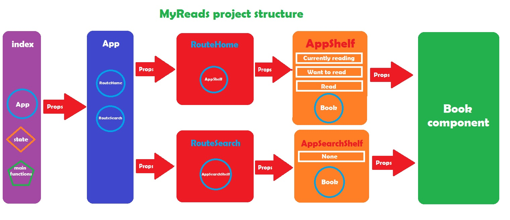

# MyReads 
React web application

### Table of contents
- Application decsription.
- How to use.
- Project files.
- Dependences.
- Application articture.
- Coding steps.
- References.

## Application description
MyReads is an application to manage and control a book library to organize the books in three shelves **Currently reading,** **Want to read** and **Read** and the ability to move these books through these 3 shelves.
Also there is a search feature to search for new books and add any book to the library.

## How to use 

to use this app you need to follw steps:
 1. Download or clone the code via github https://github.com/IbrahimAlmadawy/myreads
 2. Setup the project by running `npm install`
 3. After Completing the installation run the project by `npm start` 
 4. Browser will run the **Homepage** showing the main library with three main shelves **Currently reading,** **Want to read** and **Read**
 5. You can move any of the showen books for shelf to another via a select dropdown list at the right buttom of every book , this list contains the 3 shelves and **none** that can remove the book from the whole library.
 6. If you want to get a new book not in the library then you can click on the link on the right buttom in the **Homepage** to let you navigate through another page **Search page** to enter a string as a name or a first letter of the name of the book or the author ,When results loaded you can add it to the library via the same dropdown list and if the book exists in your library it will mark it in one of the **Homepage** shelves and if not it will be marked as **none** , You can change this none to any another shelf to move if.

 ## Project files
 This project a various files we can categorize it as main JavaScript files and style files and other files, inside **src** folder which contains **components,** **routes** and **icons** folders and the main files :
 - **component folder** : Contains three components 
    A. AppBook.js
    B. AppShelf.js
    c. AppSearchShelf.js
- **routes folder** : Contains 2 routes components:
    A. RouteHome.js
    B. RouteSearch.js
- **icons folder** : Contains used icons.
- **Files** : 
  A. APP.js
  B. BookApi.js
  C. index.js
  D. App.css
  E. index.css
  F. App.test.js
  G. package,json
  H. README.md (This file)
  I. noImage.jpg (to render if book has no image)

## Dependences:
- prop-types
- react
- react-dom
- react-router-dom
- react-scripts

## Application articture:
You can see project structure diagram 
Project has structure as:
### Components
1. **Book** component.
2. **Shelf** component.
3. **SearchShelf** component.
### Routes
1. **Home** route.
2. **Search** route.
### App
Run routes.
### index
Run App on browser.

## Coding steps
***1th*** Creating Book component class inside **AppBook.js** inside **src/components** folder.
***2nd*** Creating Shelf component class inside **AppShelf.js** inside **src/components** folder.
***3rd*** Creating Route to **Homepage** component inside **src/routes**.
***4th*** Creating Route to **Search** component inside **src/routes**.
***5th*** Modifying **App** component class to get the two routes inside it.
***6th*** Setup **BrowserRouter** inside **index.js** to run **App** component in the browser after importing **BrowserRouter** from **react-router-dom**.
***7th*** Import Routes components inside **App.js** and import **BookAPI** also inside it.
***8th*** Define **state** inside app to hold 3 states **books,** **query** and **searchBooks**.
***9th*** Get books from **getAll** API (After testing API with Postman) inside **componentsDidMount** and set the result to state **books** 
***10th*** Invoke  **books** as props inside **Home** route.
***11th*** Inside **AppShelf** I filtered the books to set inside the suitable shelf and set the props to the **Book** component.
***12th*** Define **shelfUpdater** function inside **App** to update book's shelf via calling **update** API (After tested with Postman) and invoke it as props to be used inside **shelfUp** function inside **Book** component to update shelf over books and call it when change the dropdown list option inside **select** element and edit the book image url, book name and book author.
***13th*** Define **searchQuery** function to return a search books passed on user string I set in state as **query** and also set **searchBooks** inside state to save the search result.
***14th*** Change buttons to router **Link** to navigate to between pages.
***15th*** Define **clearSearch** inside **App** to clear search page when navigate from homepage to search and return to search again.
***16th*** Fixing errors of return an empty string in the search .
***17th*** Fixing errors of entry not returning result to display a message **No books**.
***18th*** Fixing error of non existence of book image and non existence of authors by add inline ternary operators.

## References:
1. https://reactjs.org/ (Documentation)
2. Udacity React track.
3. Udacity live session.
4. https://www.w3schools.com/

